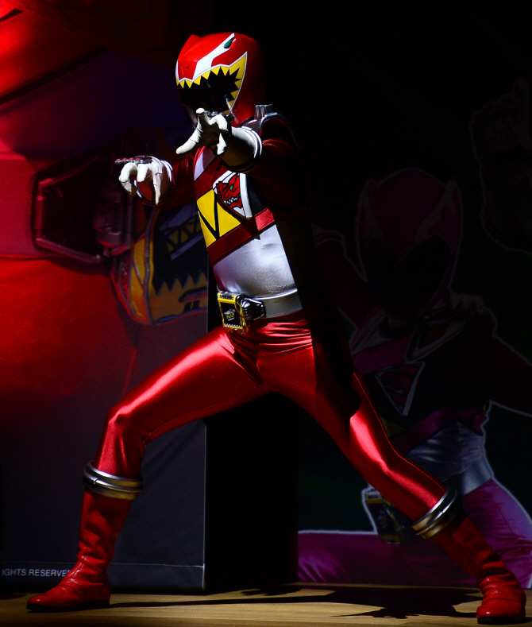

  

<h1 align="center">👋 Hello, I'm 이은복</h1>

  🚀 Backend Developer | 🎓 DSM 1st Grade

  

---

## 🧑‍💻 About Me
- 🔥 백엔드 개발을 목표로 성장 중인 학생 개발자
- 💡 서버와 데이터 처리에 관심이 많습니다
- 📈 꾸준함으로 실력을 쌓고 있습니다

---

## 🛠 Tech Stack

  
  
  
  

---

## 📚 Currently Learning
- 🌱 Spring Framework
- 🌱 RESTful API
- 🌱 Database Design

---

## 📊 GitHub Stats

  
  

---

## 🏆 Goal
- 💥 실력 있는 백엔드 개발자 되기
- 💥 프로젝트 경험 쌓기
- 💥 협업 능력 강화

---

## 📫 Contact
- GitHub: https://github.com/eunbogi99-cyber

---

  🔥 Never Stop Growing 🔥

  

